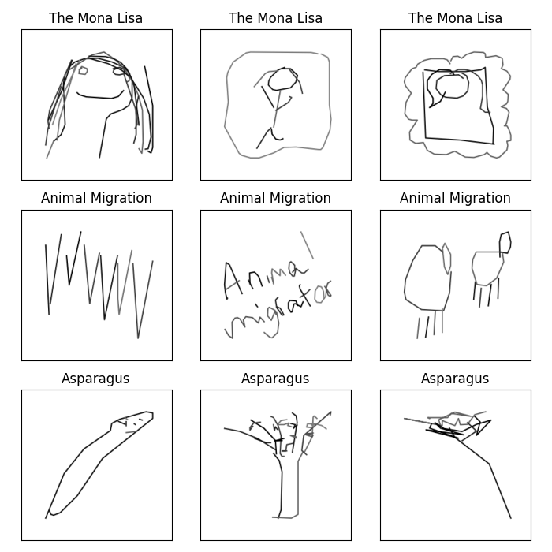

# KAGGLE-Doodle-Prediction

I took on this project to use the Kaggle-hosted [Doodle Dataset](https://www.kaggle.com/datasets/ashishjangra27/doodle-dataset) and see what I could achieve with the tools I have aquired so far!

The goal was to create a Machine Learning model that would predict well the subject of a doodle.

## The Data

The 5GB dataset of doodles contains over 1M 255x255 PNGs of doodles with 380 different labels originating from 198 countries.
 
Doodles within the same category vary greatly. It might be difficult for a model to learn such a relationship.

For Example:

## Starting at the End

The Convolutional Neural Network I trained did not perform well. In fact, its performance was no better than making random guesses.

That being said, I learned a lot during this project, which leads me to...

## What I Learned

* Separating the wheat from the chaff when working with large quantities of data.
* How to properly work with visual data.
* Working with GPUs:
  - Transferring my model to the GPU.
  - Distributing the load between multiple GPUs.
  - Constructing ML models while considering hardware limitations (2 GPU T4 - 15GB each).
* Implementing a CNN in PyTorch from scratch.

## The Strategy I Took

1.  Knowing that dealing with the entire dataset would be too challenging, I decided to trim the data and only consider a fraction of it.
2. To do that, I filtered the data using the provided `master_doodle_dataframe.csv`, focusing on the top 50 most frequent doodle labels and countries (under the assumption that the country of origin might contribute to the variance of doodles within a category). This reduced the dataset to ~140,000 doodles.
3. Realizing that it was impossible to hold the entire (new) dataset in memory, I created Dataset and DataLoader objects and used them to stream data batches to my model.
4. Created a CNN model and a training loop that provides an early stopping mechanism and statistics on the training process, such as the accuracy and completion time of each epoch.

## What Could Be Further Done to Improve the Model

- [ ] Train the current model for a larger number of epochs.
- [ ] Train the model with better hardware, which would allow for example for more samples in each batch.
- [ ] Use dimensionality reduction methods.
- [ ] Develop a better architecture within my means.
- [ ] Use an existing model or architecture that only needs to be fine-tuned on the data.
